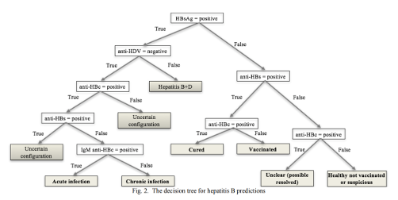

# Deskripsi

Tugas Besar 2 Mata Kuliah IF3170 Inteligensi Buatan Pembangunan Sistem Berbasis Rule dengan menggunakan CLIPS. Program sederhana dengan menggunakan CLIPS yang merepresentasikan bentuk dari decision tree dari paper From logical inference to decision trees in medical diagnosis. Decision tree ini merupakan decision tree yang digunakan untuk melakukan prediksi terkait kondisi seseorang terkait dengan hepatitis B.



# Requirements

- [CLIPS](https://clipsrules.net/)

# How To Run

```
(chdir <path to this directory>)
```
<br>

```
(load <path of this clips file>)
```
<br>

```
(reset)
```

<br>

```
(run)
```

# Anggota Kelompok

| Nama | NIM |
| --- | --- |
| Dwi Kalam Amal Tauhid | 13519210 |
| Muhammad Alif Putra Yasa | 13520135 |
| Ghazian Tsabit Alkamil | 13520165 |